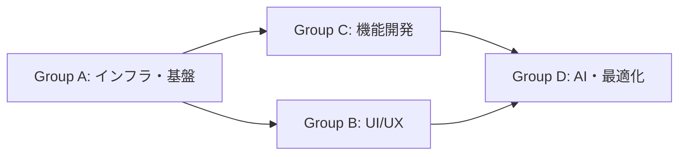

# 開発チケット一覧

## 開発グループ分類

### 🔴 Group A: インフラ・基盤チーム
**担当領域**: プロジェクト設定、データベース、認証基盤
**メンバー数**: 1-2人
**チケット**:
- Ticket #1: プロジェクト初期設定
- Ticket #2: データベース設計・構築
- Ticket #3: 認証機能（メール/パスワード）
- Ticket #4: Google認証機能

### 🟢 Group B: UI/UXチーム
**担当領域**: 画面実装、レイアウト、ビュー
**メンバー数**: 1-2人
**チケット**:
- Ticket #5: レイアウト・ナビゲーション
- Ticket #6: ホーム画面（カレンダービュー）
- Ticket #7: ホーム画面（ポートフォリオビュー）
- Ticket #13: ローディング・エラー処理
- Ticket #14: アニメーション・トランジション

### 🔵 Group C: 機能開発チーム
**担当領域**: 食事記録、タイプ管理、CRUD機能
**メンバー数**: 1-2人
**チケット**:
- Ticket #8: 食事タイプ管理機能
- Ticket #9: 食事記録作成画面（基本機能）
- Ticket #10: 食事詳細・編集画面

### 🟡 Group D: AI・最適化チーム
**担当領域**: AI機能、パフォーマンス
**メンバー数**: 1人
**チケット**:
- Ticket #11: AI画像認識API
- Ticket #12: AI認識結果UI
- Ticket #15: パフォーマンス最適化

## タイムライン（推奨）

### Week 1-2: 基盤構築
- **Group A**: #1, #2を完了、#3開始
- **Group B**: #5を完了、#6, #7開始
- **Group C**: #8開始（#2完了後）

### Week 3-4: 機能実装
- **Group A**: #3, #4完了
- **Group B**: #6, #7完了
- **Group C**: #8完了、#9, #10開始

### Week 5-6: AI機能・統合
- **Group D**: #11, #12実装
- **Group B**: #13, #14実装
- **Group C**: #9, #10完了

### Week 7: 最適化・テスト
- **Group D**: #15実装
- **全グループ**: 統合テスト、バグ修正

## Phase 1: 基本機能実装

### 🎫 Ticket #1: プロジェクト初期設定
**担当可能人数**: 1人
**依存関係**: なし
**タスク**:
- [ ] Supabaseプロジェクト作成
- [ ] 環境変数設定（.env.local）
- [ ] Supabaseクライアント設定
- [ ] 基本的なディレクトリ構造作成
- [ ] Tailwind CSS設定（カラーパレット含む）
- [ ] 共通コンポーネント用ディレクトリ作成

### 🎫 Ticket #2: データベース設計・構築
**担当可能人数**: 1人
**依存関係**: Ticket #1
**タスク**:
- [ ] Supabaseでテーブル作成（profiles, meals, meal_types, meal_suggestions）
- [ ] RLS（Row Level Security）ポリシー設定
- [ ] Storage バケット作成（meal-images）
- [ ] データベース型定義ファイル作成（TypeScript）

### 🎫 Ticket #3: 認証機能（メール/パスワード）
**担当可能人数**: 1人
**依存関係**: Ticket #1
**タスク**:
- [ ] ログインページUI作成
- [ ] 登録ページUI作成
- [ ] Supabase Auth連携
- [ ] 認証状態管理（Context/Hook）
- [ ] プロテクトルート実装
- [ ] パスワードリセット機能

### 🎫 Ticket #4: Google認証機能
**担当可能人数**: 1人
**依存関係**: Ticket #3（並行可能）
**タスク**:
- [ ] SupabaseでGoogle OAuth設定
- [ ] Googleログインボタン実装
- [ ] 認証フロー実装
- [ ] エラーハンドリング

### 🎫 Ticket #5: レイアウト・ナビゲーション
**担当可能人数**: 1人
**依存関係**: Ticket #1
**タスク**:
- [ ] ヘッダーコンポーネント作成
- [ ] ボトムナビゲーション作成（モバイル）
- [ ] サイドバー作成（デスクトップ）
- [ ] レスポンシブ対応
- [ ] ログアウト機能

### 🎫 Ticket #6: ホーム画面（カレンダービュー）
**担当可能人数**: 1人
**依存関係**: Ticket #2, #5
**タスク**:
- [ ] カレンダーコンポーネント作成
- [ ] 月表示実装
- [ ] 日付選択機能
- [ ] 食事記録の表示（サムネイル）
- [ ] 月間サマリー表示

### 🎫 Ticket #7: ホーム画面（ポートフォリオビュー）
**担当可能人数**: 1人
**依存関係**: Ticket #2, #5
**タスク**:
- [ ] グリッドレイアウト実装
- [ ] 写真サムネイル表示
- [ ] 無限スクロール実装
- [ ] ビュー切り替えボタン
- [ ] フィルター機能（食事タイプ別）

### 🎫 Ticket #8: 食事タイプ管理機能
**担当可能人数**: 1人
**依存関係**: Ticket #2
**タスク**:
- [ ] 食事タイプCRUD API作成
- [ ] タイプ選択コンポーネント作成
- [ ] 新規タイプ作成モーダル
- [ ] タイプ一覧管理画面
- [ ] 並び順変更機能

### 🎫 Ticket #9: 食事記録作成画面（基本機能）
**担当可能人数**: 1人
**依存関係**: Ticket #2, #8
**タスク**:
- [ ] 記録作成フォームUI
- [ ] 画像アップロード機能
- [ ] 画像プレビュー
- [ ] 栄養情報入力フォーム
- [ ] 食事タイプ選択
- [ ] 保存API連携

### 🎫 Ticket #10: 食事詳細・編集画面
**担当可能人数**: 1人
**依存関係**: Ticket #9
**タスク**:
- [ ] 詳細表示画面
- [ ] 編集モード切り替え
- [ ] 更新API連携
- [ ] 削除機能（確認ダイアログ付き）
- [ ] 画像の拡大表示

## Phase 2: AI認識機能実装

### 🎫 Ticket #11: AI画像認識API
**担当可能人数**: 1人
**依存関係**: Ticket #9
**タスク**:
- [ ] OpenAI API連携設定
- [ ] 画像分析エンドポイント作成
- [ ] プロンプト最適化
- [ ] レスポンス処理
- [ ] エラーハンドリング

### 🎫 Ticket #12: AI認識結果UI
**担当可能人数**: 1人
**依存関係**: Ticket #11
**タスク**:
- [ ] 認識結果表示コンポーネント
- [ ] 候補選択UI
- [ ] 信頼度表示
- [ ] 手動入力切り替え
- [ ] カロリー自動計算機能

## Phase 3: UI/UX改善

### 🎫 Ticket #13: ローディング・エラー処理
**担当可能人数**: 1人
**依存関係**: Phase 1完了後
**タスク**:
- [ ] ローディングスピナー/スケルトン
- [ ] エラー境界実装
- [ ] トースト通知
- [ ] 再試行機能
- [ ] オフライン表示

### 🎫 Ticket #14: アニメーション・トランジション
**担当可能人数**: 1人
**依存関係**: Phase 1完了後
**タスク**:
- [ ] ページ遷移アニメーション
- [ ] カード表示アニメーション
- [ ] ボタンホバーエフェクト
- [ ] スムーズスクロール
- [ ] マイクロインタラクション

### 🎫 Ticket #15: パフォーマンス最適化
**担当可能人数**: 1人
**依存関係**: Phase 2完了後
**タスク**:
- [ ] 画像最適化（next/image）
- [ ] 遅延ローディング
- [ ] キャッシュ戦略
- [ ] バンドルサイズ最適化
- [ ] Lighthouse対応

## 並行開発の推奨事項

### 同時進行可能なチケット組み合わせ
1. **初期段階**（3-4人）:
   - Person A: Ticket #1 → #2
   - Person B: Ticket #3
   - Person C: Ticket #5
   - Person D: Ticket #8

2. **中期段階**（3-4人）:
   - Person A: Ticket #6
   - Person B: Ticket #7
   - Person C: Ticket #9
   - Person D: Ticket #4 → #10

3. **AI機能段階**（2人）:
   - Person A: Ticket #11
   - Person B: Ticket #12

### 開発時の注意事項
- 各チケットごとにブランチを作成
- 型定義ファイルは共通で使用するため、早めに作成
- APIエンドポイントは事前に仕様を決めて共有
- UIコンポーネントは Storybook での確認を推奨（将来的に）
- 定期的にmainブランチにマージして統合テスト

### コミュニケーション推奨
- 日次スタンドアップミーティング
- Slackでの進捗共有
- ブロッカーの早期共有
- PRレビューの相互実施

## グループ間の依存関係

### 依存関係の詳細
1. **Group A → Group B/C**: 認証・DB設計が完了しないと画面実装が進められない
2. **Group C → Group D**: 基本的な記録機能がないとAI機能を統合できない
3. **Group B → Group D**: UI基盤がないと最適化の効果測定ができない

### 推奨開発フロー
1. **Group A**が最初に着手（特に#1, #2は最優先）
2. **Group B**は#5から開始し、Group Aの進捗に合わせて他チケットへ
3. **Group C**は#2完了後すぐに開始
4. **Group D**は他グループの基本実装後に着手